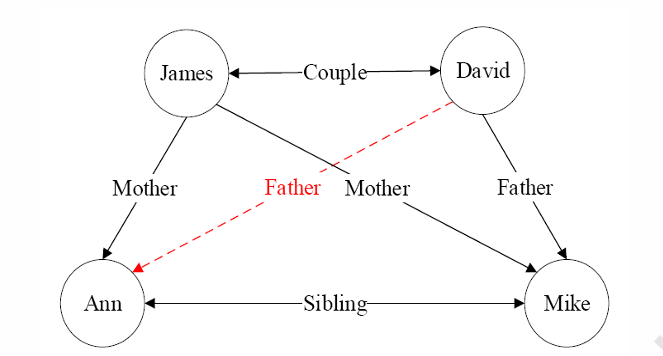

# 第2讲：形式逻辑、知识图谱与推理

## 本讲提要

- 形式逻辑：命题逻辑与谓词逻辑
- 数理逻辑与数字逻辑：从符号推理到电路实现
- 知识图谱推理：FOIL、路径排序与概率图模型

---

## 形式逻辑

形式逻辑是**研究一般思维规律**的学问，关注思维的**结构是否合理**，而不是具体内容本身。

> **核心理念**：逻辑不单纯研究知识内容，更重要的是研究**思维的结构、推理的过程是否合理、推论是否严密**。

**三个关键词**：
1. **规律** — 事物发展都有其内在的逻辑，世界的复杂现象背后往往有规则可循
2. **推理** — 著名的**三段论**：人皆有一死，苏格拉底是人，∴苏格拉底会死
3. **判断** — 对给定信息进行分析、判断、辨别的能力

---

### 命题逻辑

**定义**：把完整的陈述句当做不可分的整体进行研究，通过逻辑连接词组合原子命题。

#### 命题的定义

**命题** = 可以判断真或假的**陈述句**

关键点：
- ✅ "北京是中国的首都" → 真命题
- ✅ "2+2=5" → 假命题
- ❌ "你们在开会吗？" → 疑问句，不是命题
- ❌ "请出去" → 祈使句，不是命题
- ❌ "我正在说谎" → 悖论（互相否定），不是命题

#### 原子命题 vs 复合命题

**原子命题**：不可再分的基本单元，用 $P, Q, R$ 等表示

**复合命题**：多个原子命题通过逻辑连接词组合而成

| 连接词 | 符号 | 形式 | 真值条件 |
|--------|------|------|---------|
| 与（合取）| $\land$ | $P \land Q$ | 两个都真才真 |
| 或（析取）| $\lor$ | $P \lor Q$ | 至少一个真就真 |
| 非（否定）| $\lnot$ | $\lnot P$ | 原命题假则结果真 |
| 蕴含 | $\rightarrow$ | $P \rightarrow Q$ | 前真后假时为假，其余为真 |
| 双向蕴含 | $\leftrightarrow$ | $P \leftrightarrow Q$ | 同真或同假时为真 |

**例子**：
- "如果天气晴了，三年级二班的同学就去春游" → $P \rightarrow Q$（条件命题）
- "图灵不仅是数学家，而且是逻辑学家" → $P \land Q$（合取命题）
- "这个数要么大于3，要么小于等于3" → $P \lor \lnot P$（析取命题）

#### 命题逻辑的应用与局限

**应用**：专家系统的规则库常由这种命题组合而成
> 如：IF 机房停电 THEN 实验无法进行

**局限**：
- ❌ 无法分析句子**内部结构**，无法表达**个体关系**
- ❌ 无法解释为什么能得出结论（只能看表面形式）

**经典问题**：
$$\alpha: \text{所有的人都会死} \quad \beta: \text{苏格拉底是人} \quad \gamma: \text{苏格拉底会死}$$

用命题逻辑：$\alpha \land \beta \Rightarrow \gamma$

但这**无法表达为什么能推出**，因为：
- 关键不在于表面句式，而在于 **"人"** 这个概念的共性
- 命题逻辑把它们当成三个独立的原子命题，看不到内部的个体关系

---

### 谓词逻辑（第一阶逻辑 FOL）

**定义**：在命题逻辑基础上，进一步拆分句子，分析**个体、谓词、量词**，能表达对象及其关系。

#### 核心成分

**1. 个体（个体常项）**
- 独立存在的具体对象（可是抽象对象）
- 例：`lucy`, `Socrates`, `3`, `北京`

**2. 谓词（Predicate）**
- 描述个体的**属性**或个体间的**关系**

| 类型 | 形式 | 例子 | 含义 |
|------|------|------|------|
| 一元谓词 | $P(x)$ | `Human(Socrates)` | 苏格拉底是人 |
| | | `King(Richard)` | Richard是国王 |
| 二元谓词 | $R(x,y)$ | `Sister(lucy, lily)` | lucy和lily是姐妹 |
| | | `Capital(Beijing, China)` | 北京是中国的首都 |
| 多元谓词 | $R(x,y,z)$ | `Between(x, y, z)` | x在y和z之间 |

**符号化例子**：
- "lucy和lily是姐妹" → $\text{Sister}(\text{lucy}, \text{lily})$
- "北京是中国的首都" → $\text{CapitalOf}(\text{Beijing}, \text{China})$

**3. 量词（Quantifier）**
- **全称量词** $\forall$（对所有、任意）：$\forall x. P(x)$ = 对所有的x，都有性质P
- **存在量词** $\exists$（存在某个）：$\exists x. P(x)$ = 存在某个x，具有性质P

#### 自然语言的歧义性问题

**"所有的人都爱某个人"** ← 这句话有两种理解！

```
解释1：∀x ∃y. Love(x,y)
"对于任意一个人，都存在另一个人使得他爱那个人"
→ 每个人都有自己爱的人（可能不同）

解释2：∃y ∀x. Love(x,y)
"存在一个人，所有的人都爱他"
→ 有一个人见人爱，所有人都爱他
```

#### 三段论用谓词逻辑表达

$$\forall x. \text{Human}(x) \rightarrow \text{Mortal}(x)$$
$$\text{Human}(\text{Socrates})$$
$$\therefore \text{Mortal}(\text{Socrates})$$

现在**为什么能推出**就很清楚了：因为苏格拉底满足 `Human()` 这个谓词，而所有具有这个谓词的对象都满足 `Mortal()`。

---

## 逻辑规律（四大规律）

形式逻辑要求思维过程必须遵守的规则：

| 规律 | 内容 | 例子 |
|------|------|------|
| **同一律** | 同一思维过程中，概念必须保持一致 | 不能前半句"苹果是水果"，后半句"苹果是手机品牌" |
| **矛盾律** | 一个判断和它的否定不能同时成立 | 不能说"我吃了饭"又"我没吃饭" |
| **排中律** | 两种对立的思想必有其一为真 | 犯罪要么是故意，要么不是故意；不能既故意又不故意 |
| **充足理由律** | 做出判断必须有充足的理由 | "会读书的孩子都会玩" ← 这个推论没有必然性，理由不充足 |

---

## 我的思考：与 Lambda 演算的联系

> "这个是不是和 lambda 演算以及背后的计算理论的某些思想是类似贯通的"

**直观联系**：
- **逻辑** ≈ 符号操作 + 推理规则（如何从已知推导新知）
- **Lambda演算** ≈ 函数抽象 + 应用机制（如何表示计算）

两者都在做**形式化、符号化、规则化**的事情。

**Curry–Howard对应**（深层联系）：
$$\text{证明} \approx \text{程序} \quad | \quad \text{命题} \approx \text{类型}$$

例：
- 命题 $A \rightarrow B$ 对应 类型 $A \to B$ 的函数
- $A$ 的一个证明 对应 类型 `A` 的一个值
- 证明 $A \rightarrow B$ 对应 实现函数 `A -> B`
- 证明的"使用" 对应 函数应用

**关键区别**：
- 谓词逻辑：关注**可量化的对象与关系**（what exists）
- Lambda演算：关注**函数与计算步骤**（how to compute）
- 要把FOL完全编码成$\lambda$演算需要**高阶逻辑**或**类型论**
## 数理逻辑

数理逻辑是在形式逻辑基础上，用**数学符号和真值表**把推理完全形式化的一门学科。

### 布尔代数与基本连接词

在布尔代数中，命题只取两种值：$1$(真) 或 $0$(假)。常见运算：

- 与：$A \land B$（只在 $A=B=1$ 时为 1）
- 或：$A \lor B$（只在 $A=B=0$ 时为 0）
- 非：$\lnot A$（翻转真值）
- 异或：$A \oplus B$（恰好一个为真时为 1）
- 蕴含：$A \rightarrow B$（只在 $A$ 真、$B$ 假时为假）
- 等价：$A \leftrightarrow B$（$A,B$ 同真同假时为真）

**蕴含的“承诺”含义**：
- “如果今天下雨($P$)，我就去接你($Q$)” 对应 $P\rightarrow Q$。
- 只有“下雨但没去接”这一种情况，违背了承诺，因此为假；其他三种情况都算“没有违背承诺”，视为真。

数理逻辑通过这套符号体系和推理规则（如假言推理、与导入/消去、双重否定等），为后面的**数字逻辑电路设计**和**自动推理系统**提供了严格基础。

### 信息熵与信息增益：连接逻辑与学习

信息论给出一个度量不确定性的工具——**熵**：
$$H(X) = - \sum_x p(x) \log p(x)$$

- 分布越均匀（越不确定），熵越大；分布越集中（越确定），熵越小。
- 基底选 $\log_2$ 时，单位是“比特”。

在监督学习里，常用**信息增益**来衡量“某个特征/条件带来了多少确定性提升”：
$$IG(Y, A) = H(Y) - H(Y\mid A)$$

- 决策树：选择让 $IG$ 最大的特征做划分，相当于“让标签熵下降最快”的划分最好。
- 后面讲的 FOIL 算法，也用类似的信息增益思想：但“特征”变成了**逻辑文字（谓词条件）**，目标是让“当前覆盖的样本中正负例更纯”。

这就是逻辑推理与机器学习（信息论）的第一次结合点。

---

## 数字逻辑

数字逻辑关心的是：**如何把布尔代数用电子电路实现出来**，让计算机真正“执行”逻辑。

### 逻辑门与二进制

- 用**高电平/低电平**表示 $1/0$，就能把逻辑运算变成电路中的导通/不导通。
- 基本逻辑门：与门(AND)、或门(OR)、非门(NOT)、与非门(NAND)、或非门(NOR)、异或门(XOR) 等。
- 所有复杂逻辑都可以由少数几种门（如 NAND 门）组合实现。

计算机采用**二进制**编码数值：
- 例如 $1001_2 = 1\cdot 2^3 + 0\cdot 2^2 + 0\cdot 2^1 + 1\cdot 2^0 = 9_{10}$。
- 加法、乘法最终都分解为大量的“按位加/按位乘 + 进位”的布尔运算。

### 半加器与全加器

- 半加器：输入一位二进制的 $A,B$，输出**和** $S$ 与**进位** $C$。
	- $S = A \oplus B$（异或的真值表与一位二进制加法的“和”完全一致）
	- $C = A \land B$
- 全加器：在半加器基础上，再加入来自低位的进位 $C_{in}$，输出 $S$ 与新的进位 $C_{out}$。
- 多位加法器：把若干个全加器**级联**起来，每一级的 $C_{out}$ 作为高一位的 $C_{in}$。

这体现了一个非常重要的工程思想：
- **用极简单的局部单元（逻辑门、加法器）层层组合，构造出能执行复杂算法的计算机。**
- 深度学习里的网络层、本质上也是类似的“简单模块的巨大组合”，底层依然只是乘法和加法——也就都可以还原到布尔电路上。

---

## 知识图谱与逻辑推理



### 什么是知识图谱？

结合上面的 `familytree.png`，知识图谱其实就是用**图（Graph）网络**来表示现实世界万事万物及其相互关系的一种数据结构。在这个图里：

- **节点（Entity / 实体）**：图中的圆圈。代表具体的对象。比如图中的 `James`, `David`, `Ann`, `Mike`。
- **边（Relation / 关系）**：连接圆圈的黑线/红线。代表实体之间的关系。比如 `Father`, `Mother`, `Couple`（夫妻）, `Sibling`（兄弟姐妹）。

在计算机中，我们通常用**三元组（Triples）**来记录图中的每一条边。公式是：$\langle \text{头实体},\ \text{关系},\ \text{尾实体} \rangle$。
看图我们可以写出很多三元组，比如：
- $\langle David,\ Father,\ Ann \rangle$
- $\langle James,\ Mother,\ Mike \rangle$
- $\langle James,\ Couple,\ David \rangle$

在逻辑学上，这也就是我们前面讲的**一阶谓词**，例如写成：`Mother(James, Ann)`。

### 核心任务：关系推理（Link Prediction）

你在 `familytree.png` 中一定注意到了那条**红色的虚线 `Father`**。这就是知识图谱最经典的任务：**推断未知/缺失的边**。

假设由于数据缺失，图谱里一开始没有 `Father(David, Ann)` 这个信息（即红线原本不存在）。
人类看一眼图就能推理出来：“既然 James 是 Ann 的妈妈，而 David 又和 James 是夫妻，那 David 肯定就是 Ann 的爸爸啦！”

**如何让机器像人一样看懂这张图并推理出红色的虚线？** 机器需要学会从已知连线中寻找规律并总结出“逻辑规则”。
接下来我们介绍的 FOIL 算法，就是为了解决这个问题的。

---

## FOIL 算法：像侦探破案一样学逻辑规则

FOIL（First-Order Inductive Learner）是一种经典的归纳逻辑程序设计算法。它的作用是：**给它一堆知识图谱的已知事实（黑线），它能自动帮你总结出人类能看懂的推导公式（推理规则）**。

最终它要学出的规则长这样（霍恩子句）：
$$Father(x,y) \leftarrow Couple(x,z) \land Mother(z,y)$$
*(读作：如果 x 和 z 是夫妻，且 z 是 y 的妈妈，则推导出 x 是 y 的爸爸)*

> **符号小贴士：`:-` 是什么？**
> 在接下来的推理推导过程中，你会看到类似 `Father(x,y) :- Couple(x,z)` 的写法。
> 这里的 `:-` 是逻辑编程语言（如经典的 Prolog）中表示“**如果**”（if）或“**被……蕴含**”（等同于数学符号 $\leftarrow$）的专用符号。
> `结论 :- 条件` 也就是前面讲的霍恩子句结构，等价于“如果满足右边的条件，左边的结论就成立”。

### 问题设定：侦探的线索板

- **目标（要预测什么）**：找出谁是谁的爸爸，即学习 `Father(x,y)` 的规则。
- **正例（必须命中的嫌疑人）**：图上已知对的 `Father` 关系，比如 `Father(David, Mike)`。（假设图谱中还有其他真实的父子对）
- **反例（绝对不能错杀的好人）**：随便乱搭的错误关系，比如 `Father(James, Ann)`（James是女的，不能是Father），或者 `Father(Ann, Mike)`。
- **背景知识（手头的线索库）**：图上的其他关联，比如 `Couple(x,z)`, `Mother(z,y)`, `Sibling(x,y)`。

我们的任务是：组装这些线索（谓词），搞出一条规则，**全覆盖正例，零误伤反例**。

### FOIL的推导过程（序贯覆盖）

我们可以把 FOIL 找规则的过程想象成“通过提问不断缩小嫌疑人范围”的侦探游戏。

1. **初始“空”规则**：`Father(x,y) :- true`
	- 一开始，规则极其宽松，可理解为“任意实体对都可能满足 `Father(x,y)`”。
   - 结果：涵盖了所有的正例（David当然被包括了），但也**涵盖了海量的反例**（图中任意两个人组合都被算作父子了）。太糟糕了，需要添加限制条件！

2. **第一轮挑选线索（找增益最大的）**：
   - 机器开始在背景库里挨个尝试加入条件：
     - 如果加入 `Sibling(x,y)`？不行，无法区分正反例。
     - 如果加入条件 `Couple(x, z)`？意思是：“作为爸爸候选人的 x，首先他得有个配偶 z”。
	- **信息增益的作用**：机器发现，加入 `Couple(x, z)` 后，像 `Ann` 或 `Mike` 这类没有配偶关系的实体会被从候选集中剔除，**反例数量骤降，纯度显著提升**，这也正是决策树中的**信息增益**（熵值下降最快）。
   - 于是，第一阶段规则变为：`Father(x,y) :- Couple(x,z)`。

3. **第二轮继续挑选**：
   - 现在嫌疑人名单里可能还有错（比如可能推算出 James 是 Ann 的爸爸，因为 James 在 `Couple` 关系里）。
   - 机器继续尝试加线索。当机器摸索到 `Mother(z,y)` 时（意思是 x 的配偶 z 必须是孩子 y 的母亲）：
   - 带入图谱一看：x = David, z = James, y = Ann。大圆满！`Couple(David, James)` 成立，`Mother(James, Ann)` 也成立！
   - 加入这个条件后，所有荒谬的反例（比如把 James 当爸爸的组合）都被彻底**剔除干净**了。

4. **敲定规则**：
   - 因为当前规则已经**不再覆盖任何反例**（纯度达到100%），机器停止叠加条件。
   - 恭喜，我们获得了一扇通往真相的大门：
     $$Father(x,y) \leftarrow Couple(x,z) \land Mother(z,y)$$
   - 用这条机器自己摸索出的规则，就能轻松预测出红色的未知虚线 `Father(David, Ann)` 啦！

换句话说：
> **决策树是在表格的某一列特征里找“信息量最大的切分点”；而 FOIL 算法是在知识图谱这种纷繁复杂的网状世界里，找出了“信息量最大的一条关系路径（线索）”来断案。**

---

## 路径选择（Path Ranking）

除了显式学逻辑规则外，还有一种更“统计学习式”的知识图谱关系推理方法：**路径排序算法（Path Ranking / Path Ranking Algorithm, PRA）**。

核心想法：
- 把两个实体之间的**路径**当作特征，训练一个模型来判断目标关系是否成立。

典型流程：

1. **特征抽取**：
	 - 对于实体对 $(s,t)$，在图中用随机游走、宽度优先(BFS)、深度优先(DFS) 等方法，枚举从 $s$ 到 $t$ 的若干条路径，如：
		 - $s \xrightarrow{Couple} z \xrightarrow{Mother} t$
		 - $s \xrightarrow{Sibling} u \xrightarrow{Father} t$ 等。
	 - 每一条不同的路径模式视作一个特征 $P_i$。
2. **特征计算**：
	 - 对每个训练样本 $(s,t)$，计算：
		 - 是否存在路径 $P_i$（0/1）；或
		 - 通过该路径到达的概率/次数等。
	 - 得到一个特征向量 $\mathbf{x}_{s,t}$。
3. **模型训练**：
	 - 用这些特征和标签（关系是否存在）训练一个分类器/排序模型（如逻辑回归、线性模型等）。
4. **推理阶段**：
	 - 对新的实体对 $(s,t)$，同样提取路径特征，送入模型，得到目标关系存在的概率或打分。

与 FOIL 相比：

- FOIL 给出的是**显式的逻辑规则**（可读性强）。
- 路径排序方法给出的是**统计模型**，更接近传统机器学习，但可解释性略弱。

两者都在利用“图中的路径结构”进行关系推理，只是形式不同。

---

## 概率图推理

现实世界中很多关系是**不确定**的：

- 传感器有噪声、观测不完全；
- 因果关系并非绝对，而是“有一定概率发生”。

概率图模型（Probabilistic Graphical Models）把**图结构**与**概率论**结合，用来刻画这种不确定性。

### 两类典型模型

- **贝叶斯网络（Bayesian Network）**：
	- 有向无环图（DAG）；
	- 节点 = 随机变量（如“是否下雨”、“是否洒水”、“草坪是否湿”）；
	- 边 = 条件依赖关系；
	- 每个节点配一个**条件概率表(CPT)**，如 $P(\text{WetGrass} \mid \text{Rain}, \text{Sprinkler})$。

- **马尔可夫网络（Markov Network）**：
	- 无向图；
	- 适合表示对称依赖关系（如邻接像素之间的平滑性约束）。

贝叶斯网络一个重要性质是**局部马尔可夫性**：

- 在已知一个节点的父节点的条件下，它与所有“其他非后代节点”条件独立。
- 直观理解：知道了直接原因，其它更远的节点对当前变量就不再有额外影响。

### 概率推理（以贝叶斯网络为例）

常见问题：给定部分变量的观测值，推断其他变量的后验概率，例如：

- 已知“草坪是湿的”，推测“更有可能是下雨导致，还是洒水导致”。

用到的核心公式仍然是贝叶斯公式和全概率公式，例如：

$$P(\text{Rain}\mid \text{Wet}) = \frac{P(\text{Rain}, \text{Wet})}{P(\text{Wet})}$$

通过图结构将联合概率分解，再进行求和/归一化，就可以完成复杂的不确定推理。

---

整体来看，本节从：

- 形式逻辑 → 数理逻辑 → 数字逻辑：把“可推理的结构”一步步变成“可计算的电路”；
- 知识图谱 → FOIL / 路径排序 → 概率图模型：展示了在 AI 中如何利用逻辑和概率，

既能做**可解释的符号推理**，又能做**鲁棒的统计推理**。
